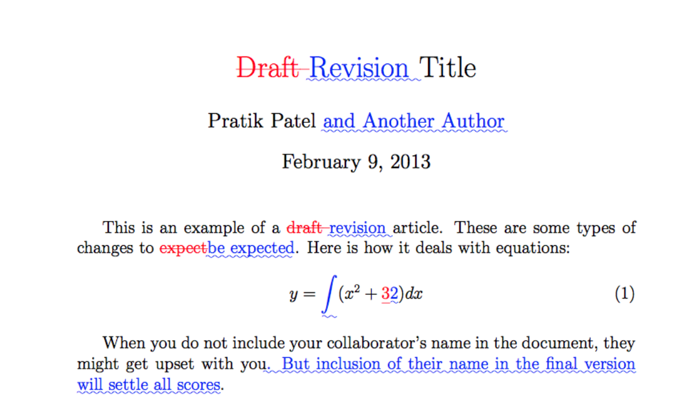

# HOW TO PREPARE A GENERIC SCIENTIFIC MANUSCRIPT FOR SUBMISSION USING MARKDOWN AND PANDOC

<!---
Make final changes for submission
Commit, add tag:
$ git commit -m 'Revised version for submission'
$ git tag -a v4_revised -m "Revised version for submission"
Generate PDF of tracked changes:
$ python papermate.py --tags v4_revised v3_submitted
$ git tag -n
-->

First A. Author^1^, Second B. Author^2^, Third Author^3^, Last  Author^1,2,3^, New LastAuthor^2^

1. University of Pandoc, Randwick, NSW, Australia
2. Markdown Institute, Ottawa, ON, Canada
3. LaTeX Research Institute, Kingston, On, Canada

\

__Corresponding author__ \
Dr Joanna Diong \
School of Medical Sciences, Faculty of Medicine and Health \
The University of Sydney \
NSW 2006, Australia \
email: joanna.diong@sydney.edu.au \
ph: +61-2-8627-5491

\

__Keywords:__ Pandoc, Markdown, Latex \
__Running title:__ Markdown manuscript \
__Wordcount:__ 4,321

\newpage

# Abstract
__Background.__ 
__Methods.__ 
__Results.__ 
__Conclusion.__ 

\newpage

# Introduction


References.
Bibliography: [@Diong2012a; @Diong2012b]
In text: @Diong2015

Footnote: `[^1]: Footnote.` 

# Methods

\begin{equation}
\end{equation}

$sw_{i} = \frac{P(A_{i} = a_{i})} {P(A_{i} = a_{i} \mid C_{i} = c_{i})}$

where

* $sw_{i}$: stabilised weight for each individual $i$


## Participants


## Experimental set-up


## Protocol


## Statistical analysis


# Results


## Outcome 1


## Outcome 2


# Discussion


\newpage

# References

\singlespacing

::: {#refs}
:::

\newpage

# Tables

<!---
Add caption, allow for one empty line and start the caption with 'Table: '
To ensure LaTeX produces the table in the expected location, use `\clearpage` between each new table you add.
-->


\newpage

# Figures

```markdown
{ width=10cm }
{ height=10cm }
```


\newpage

# Acknowledgements


# Funding


# Author contributions


\clearpage

Atom editor. 
`character-map` plugin, hotkey, `Alt-l`. Typed `plusminus`: `±`. 


Inline formatting    Pandoc Markdown command   Result
------------------   ------------------------  ---------------
Bold                 `**bold**`                **bold**
Italic               `*italic*`                *italic*
Superscript          `x^2^`                    x^2^
Subscript            `x~2~`                    x~2~
Emdash               `--`                      --

Table: Fundamental inline formatting in Pandoc-flavoured Markdown

\clearpage

Character name       output
---------------      -------
Degree symbol        °
Greek letters        β α
plus-minus           ±
Sumamtion            ∑
Trademark            ™
Copyright            ©
Money                ¢ £ €

Table: Example of special characters that can be typed directly into a text editor and are properly rendered by Pandoc, without using the LaTeX math-mode or other packages.

\clearpage

Atom plugins                 Functionality
---------------              --------------
`autocomplete-bibtex`        Amazing plugin that simplifies entering reference key
`character-table`            For insert special characters
`language-markdown`          To allow language highlighting for Markdown
`pdf-view`                   Provides in-editor PDF reviewer
`platformio-ide-termial`     An embedded terminal window to run your Pandoc commands
`tool-bar-markdown-writer`   Helpful when first learning Markdown and its commands
`markdown-preview`           Provides real-time HTML rendered view of Markdown document
`wordcount`                  Wordcount of current document
`markdown-fold`              Can fold sections, and thus focus on parts of document

Table: Atom plugins that make writing (Markdown) documents a joy.

\clearpage

{ width=16cm }

\clearpage

{ width=14cm }

\clearpage

{ width=14cm }

