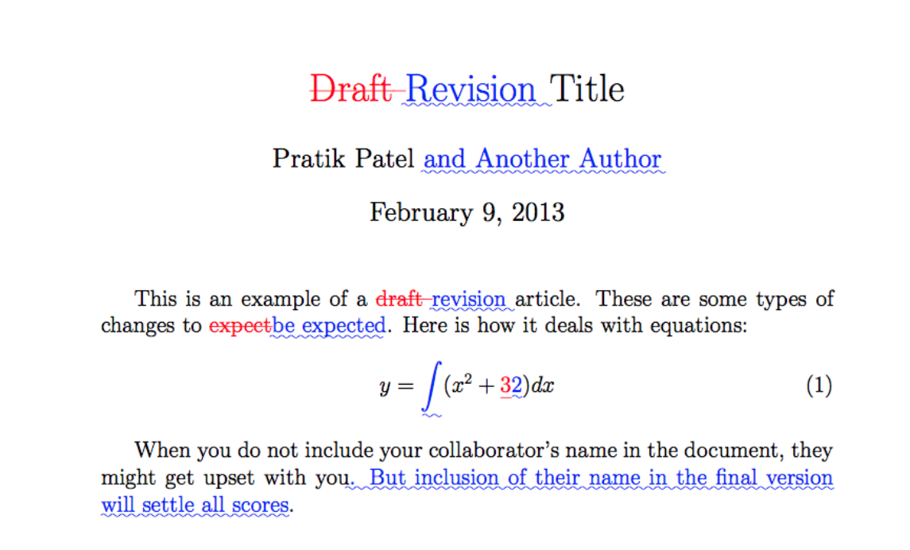

# [Title]: Study notes

First A. Author^1^, Second B. Author^2^, Third Author^3^, Last  Author^1,2,3^, New LastAuthor^2^

1. University of Pandoc, Randwick, NSW, Australia
2. Markdown Institute, Ottawa, ON, Canada
3. LaTeX Research Institute, Kingston, On, Canada

\
\

<!---
Lines can be added or deleted
If adding line in middle, end line with a space and \
-->

\newpage

# Note 1

Atom editor. 
`character-map` plugin, hotkey, `Alt-l`. Typed `plusminus`: `±`. 

References.
Bibliography: [@Diong2012a; @Diong2012b]
In text: @Diong2015

Footnote: `[^1]: Footnote.` 

# Note 2

{ width=10cm }

\newpage

# Summary

# References

\singlespacing

::: {#refs}
:::
