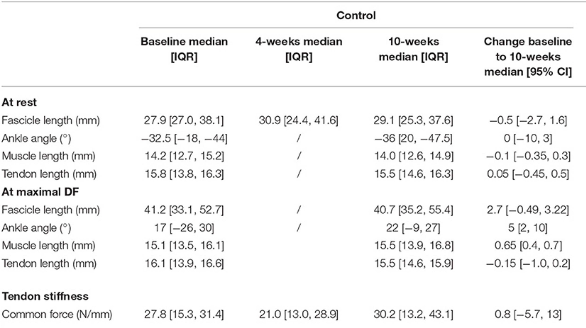

[//]: # (comment)

# Header 1

1. How should original research be written for publication?
2. The structure of a research paper is designed to convey specific information. 

# Header 2

* Title
* Introduction

*italics*
__bold__

Principles adapted from [@Lindsay2013]

# Tables

| 1.                                 | 2.                                 |
| ---------------------------------- | ---------------------------------- |
| Experimental design                | Design of survey                   |
| Experimental animals and diet      | Selection of patients              |
| Administering infusions            | Information sought from patients   a) before treatment   b) after treatment |
| Sampling                           | Clinical information from doctors  |
| Analytical methods                 | Statistical analysis               |
| Statistical analysis               |                                    |

# Figures

{width=100% height=100%} [@Kalkman2019]

# Inserting links

* Only one-third of 100 psychology studies could be reproduced ([Open Science Collaboration 2015]("http://science.sciencemag.org/content/349/6251/aac4716"))
* Only 6 out of 53 landmark studies in oncology and haematology could be replicated ([Begley and Ellis 2012]("http://www.nature.com/nature/journal/v483/n7391/full/483531a.html"))

# References

